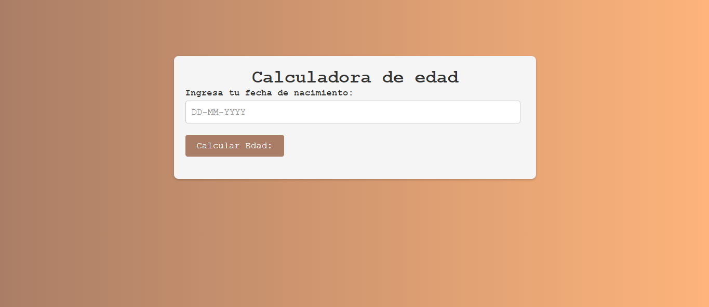
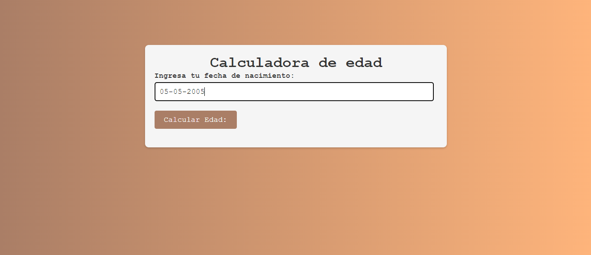
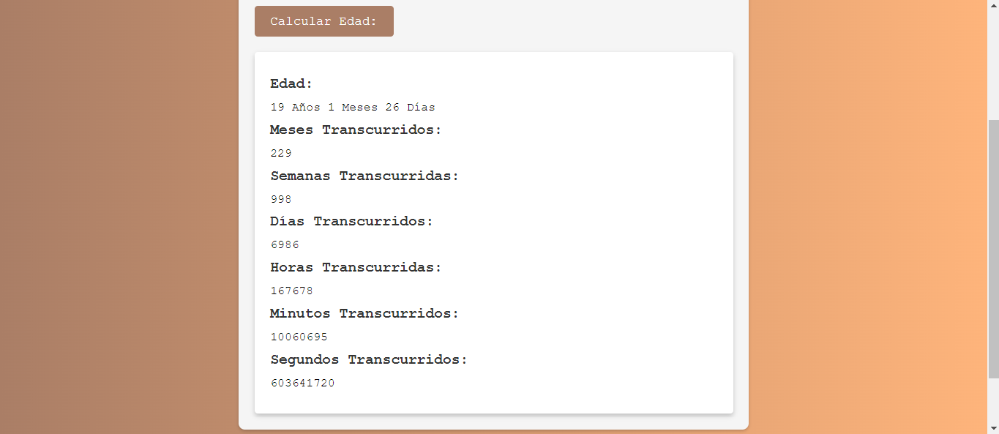

# Calculadora de Edad

Una aplicación web para calcular la edad basada en la fecha de nacimiento proporcionada. La aplicación muestra la edad en años, meses, días, así como el tiempo transcurrido en semanas, días, horas, minutos y segundos.



## Características

- **Cálculo de Edad:** Calcula la edad en años, meses y días.
- **Detalle del Tiempo Transcurrido:** Muestra el tiempo transcurrido en semanas, días, horas, minutos y segundos.
- **Interfaz Sencilla:** Interfaz amigable y fácil de usar.

## Instalación y Uso

1. **Clonar el repositorio:**
   ```bash
   git clone https://github.com/Nathaly-Daza/GeneradordeEdad.git
   ```

2. **Navegar al directorio del proyecto:**
   ```bash
   cd GeneradordeEdad
   ```

3. **Abrir el archivo `index.html` en tu navegador:**
   ```bash
   open index.html
   ```
   O simplemente arrastra el archivo `index.html` a una ventana de tu navegador.

## Archivos del Proyecto

- `index.html`: El archivo HTML principal que estructura la aplicación.
- `style.css`: Archivo CSS que contiene los estilos de la aplicación.
- `script.js`: Archivo JavaScript que maneja la lógica de la aplicación.
- `img/screenshot_main.png`: Captura de pantalla de la aplicación (debes añadir esta imagen).

## Capturas de Pantalla

### Vista Principal



### Resultado del Cálculo



## Personalización

Puedes personalizar la aplicación modificando los archivos `style.css` y `script.js` según tus necesidades. Por ejemplo, puedes cambiar los colores, fuentes o diseños utilizados.

## Contribuciones

Las contribuciones son bienvenidas. Por favor, abre un issue para discutir cualquier cambio que te gustaría realizar.

## Visualización

https://nathaly-daza.github.io/GeneradordeEdad/
